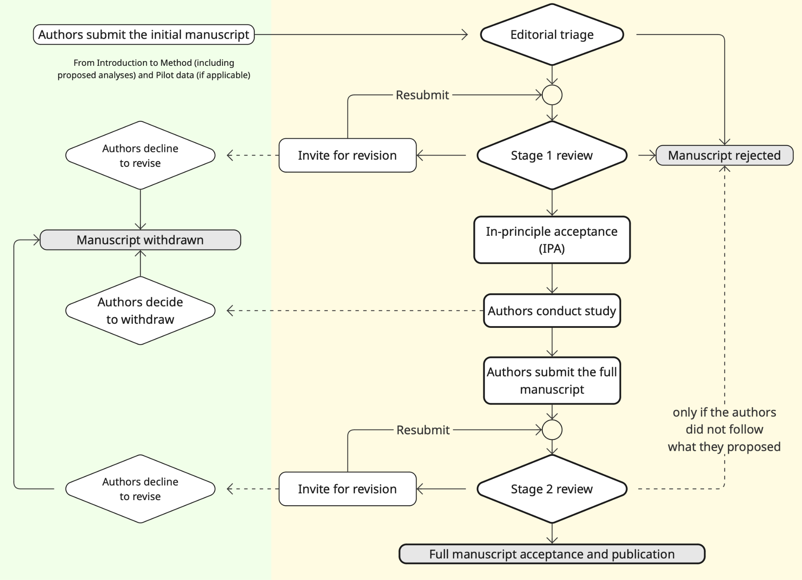

This page describes the Registered Reports format and the process for authors. If you have been invited to review a Registered Report, see the [Registered Reports reviewer guidelines](registered-reports-reviewers.qmd).

## 1. Introduction to the format

**Registered Reports** are a form of **empirical** article in which the **methods and proposed analyses are peer-reviewed and registered prior to research being conducted**. This format is designed to focus on the relevance of the research questions that are being investigated and the appropriateness of the chosen methods instead of the results. It thus intends to minimize bias in deductive science, publication bias, and reviewer bias against null results, while also allowing complete flexibility to conduct exploratory (unregistered) analyses and report serendipitous findings.

**Some reasons to submit a Registered Report instead of a normal article**

- Your research study design is complicated, and you want to get it right.
- You are several teams of researchers who together test competing theories and want the journal as a neutral 3rd party to help ensure sound and fair methodology.
- You are conducting a substantial study on a research question that is important to the field.

The Registered Reports format is an addition to the existing publication tracks. If your research is not suitable for this format, you can still submit in the existing tracks.

## 2. An overview of the reviewing process

The cornerstone of the Registered Reports format is that a significant part of the manuscript will be assessed prior to data collection. Initial submissions will include a description of the key research question and background literature, hypotheses, experimental procedures, analysis pipeline, a plan to ensure appropriate statistical power, and pilot data (where applicable).

Initial submissions will be triaged by an Action Editor for suitability. Manuscripts that pass triage will then be sent for in-depth peer review **(Stage 1)**. Following review, the article will then be either rejected or accepted in principle for publication. Following the in-principle ***acceptance* (IPA)**, the authors will then proceed to conduct the study, adhering as closely as possible to the peer-reviewed procedures.

When the study is complete, the authors will submit their finalized manuscript for re-review **(Stage 2)** and will upload their raw data, digital study materials, and analysis code (if applicable) to a publicly accessible file-sharing repository. Pending a sensible interpretation of the findings and discussion, **the manuscript will be published regardless of the results.**

{fig-alt="Flowchart of the two-stage Registered Reports review process."}

## 3. Preparing the initial manuscript

Authors shall prepare the **cover letter** and the **manuscript**.

The cover letter must include:

- A brief **scientific case** for consideration. Replication studies are welcome in addition to novel studies. Authors are encouraged to refer to the likely [replication value](http://dx.doi.org/10.1177/1745691612459058) of the research.
- A statement confirming that all necessary **support** (e.g., funding, facilities) **and approvals** (e.g., ethics) are in place for the proposed research. Note that manuscripts will be generally considered only for studies that are able to commence immediately; however, authors with alternative plans are encouraged to contact the JoVI organizing committee [organizers@journalovi.org](mailto:organizers@journalovi.org) for advice.
- An anticipated **timeline** for completing the study if the initial submission is in-principle accepted. This timeline can be provided in relation to the IPA date. After the paper receives the IPA, adjustments to this timeline and further extension can be discussed with the Action Editor.
- A statement confirming that the authors **agree to share** their raw data, any digital study materials, and analysis code (if applicable).
- A statement confirming that, following Stage 1 IPA, the authors **agree to register** their approved protocol on the Open Science Framework (<https://osf.io/>) or other recognized repository, either publicly or under private embargo until submission of the Stage 2 manuscript.
- A statement **confirming** that the authors will submit Stage 2 or otherwise inform the Action Editor in a timely manner.
- A statement confirming that **if the authors later withdraw** their paper, they agree to the journal publishing a short summary of the preregistered study under a section [*Withdrawn Registrations*](withdrawn-registrations.qmd).

The manuscript should include the parts listed below.

### Background

One or more sections with the title such as Introduction, Background, or Related Work. These sections motivate the research question and should include a review of the relevant literature

After Stage 1 IPA, this section shall not be altered. Therefore, this section must not be contingent on the results of the study.

### Methods

Full description of proposed **sample characteristics**, including criteria for data inclusion and exclusion (e.g., outlier extraction). Procedures for objectively defining exclusion criteria due to technical errors or for any other reasons must be specified, including details of how and under what conditions data would be replaced.

::: {.rr-tips}
{fig-alt=""} **Tips**

For data exclusion criteria, specify both at the level of participant and at the level of data within each participant. In the interests of clarity, we recommend listing the exclusion criteria systematically (e.g., as a hierarchical bullet points or a flow chart) rather than describing them in prose. See also examples in stage 2 ["How the data collection unfolded"](#how-the-data-collection-unfolded) below.
:::

A description of **study procedures** in sufficient detail to allow another researcher to repeat the methodology exactly, without requiring further information. (For example, your survey design, or which factors in ANOVA.)

These procedures must be adhered to as closely as possible in the subsequent experiments. Otherwise, both the Stage 1 and Stage 2 manuscripts can lose their Registered Report status. See Stage 2 [“Results & Discussion”](#results-and-discussion) for details and exceptions.

Proposed **analysis pipeline**, including all preprocessing steps, and a precise description of all planned analyses, including appropriate correction for multiple comparisons. Any covariates or regressors must be stated. Where analysis decisions are contingent on the outcome of prior analyses, these contingencies must be specified and adhered to.

Any description of prospective methods or analysis plans should be written in the future tense.

::: {.rr-tips}
{fig-alt=""} **Tips**

To maximize clarity of correspondence between predictions and analyses, authors are encouraged to number their predictions and then number the proposed analyses to make clear which analysis tests which prediction.
:::

Describe **quality check criteria** that must be met to determine that the study was conducted successfully. These criteria must be outcome-neutral. Such quality checks might include manipulation checks, [positive controls](#positive-controls), the absence of floor or ceiling effects in data distributions, or other quality checks that are orthogonal to the experimental hypotheses.

::: {#positive-controls .rr-tips}
{fig-alt=""} **Tips: Positive controls**

When there are well-established effect sizes for the phenomenon you are studying, consider including a **positive control**.
HCI research often includes a *control condition* where the active component of the manipulation is omitted. 
A positive controls is an additional condition "in which participants receive a treatment that should have an obvious and predictable effect on the outcome. 
Positive controls allow researchers to test whether their methods are appropriately sensitive […] 
If the experiment is conducted, and an effect of the positive control is not observed, it suggests that there may be some flaw in the methods or measures." [Hilgard (2021)](https://doi.org/10.1016/j.jesp.2020.104082)
For a practical introduction to choosing positive controls, see Calin-Jageman (2018), ["Positive Controls for Psychology"](https://thenewstatistics.com/itns/2018/06/24/positive-controls-for-psychology-my-pitch-for-a-sips-project/).

**Positive controls and manipulation checks are not the same thing**, although the two terms are often used interchangeably. They answer different questions, and each can pass while the other fails:

- A **positive control** adds a *condition*, determining whether the study was capable of registering an effect at all. Without one, a null result cannot be distinguished from a study that lacked the sensitivity to detect anything.
- A **manipulation check** adds a *measure*, checking whether participants noticed the manipulation, understood the manipulation, or read and attended to the experimenters' instructions [(Gruijters, 2022)](https://doi.org/10.1016/j.jesp.2021.104251).

Examples of manipulation checks in HCI and visualization: [Dey et al. (2020)](https://doi.org/10.1145/3313831.3376325); [Padilla et al. (2023)](https://doi.org/10.1109/TVCG.2022.3209457). The latter example additionally report a sensitivity analysis of whether excluding participants who failed the manipulation check would change their results.
:::

#### Statistical power 
Since publication bias overinflates published estimates of effect size, power analysis should be based on the lowest available or meaningful estimate of the effect size.

::: {.rr-tips}
{fig-alt=""} **Tips**

There are many nuances in estimating the desired effect sizes, and this practice has yet to be prevalent in the HCI literature. [Lakens (2022)](https://doi.org/10.1525/collabra.33267) provides an approachable yet comprehensive introduction to this topic.
:::

Although the following criteria may appear to be stringent, we remind the authors that once the statistical analysis plan is approved at Stage 1, the authors are given an in-principle acceptance regardless of what the final outcome of the statistical tests will be.

Studies involving **Neyman-Pearson inference** must include a statistical power analysis. Estimated effect sizes should be justified with reference to the existing literature, theory, or previous effect sizes in HCI (e.g., a survey by [Ortloff et al. (2025)](https://doi.org/10.1145/3706598.3713671)).

In the case of highly uncertain effect sizes, a variable sample size and interim data analysis are permissible, but with inspection points stated in advance, appropriate Type I error correction for ‘peeking’ employed, and a final stopping rule for data collection outlined. For more on this topic, see [Lakens (2014)](https://doi.org/10.1002/ejsp.2023) [\[link to non-paywalled preprint\]](https://doi.org/10.31234/osf.io/9yegd).

Methods involving **Bayesian hypothesis testing** are encouraged. For studies involving analyses with Bayes factors, the predictions of the theory must be specified so that a Bayes factor can be calculated. Authors should indicate what distribution will be used to represent the predictions of the theory and how its parameters will be specified.

::: {.rr-example}
**Example**

Will you use a uniform up to some specified maximum, or a normal/half-normal to represent a likely effect size ([Dienes, 2014](https://doi.org/10.3389/fpsyg.2014.00781)), or a JZS/Cauchy with a specified scaling constant ([Rouder et al., 2009](https://doi.org/10.3758/PBR.16.2.225))?
:::

For inference by Bayes factors, authors must be able to guarantee data collection until the Bayes factor is at least 3 times in favor of the experimental hypothesis over the null hypothesis (or *vice versa*). Authors with resource limitations are permitted to specify a maximum feasible sample size at which data collection must cease, regardless of the Bayes factor; however to be eligible for an IPA, this number must be sufficiently large that inconclusive results at this sample size would nevertheless be an important message for the field.

::: {.rr-tips}
{fig-alt=""} **Tips**

For further advice on Bayes factors or Bayesian sampling methods, prospective authors are encouraged to read this key article by [Schönbrodt and Wagenmakers (2018)](http://doi.org/10.3758/s13423-017-1230-y) (alternative [pre-print link](https://doi.org/10.31219/osf.io/d4dcu)).
:::

For studies that use **statistical estimation** approaches, there are corresponding procedures to the hypothesis-testing approaches above. For the confidence intervals, see: Cumming & Calin-Jageman (2024), [Introduction to the New Statistics](https://thenewstatistics.com/itns/), under the section “Precision for planning”.

Regardless of the statistical approach, data analysis method should take into account the possibility that the study will turn out to be potentially low power.

#### The interpretative plan
The interpretive plan specifies which outcomes will be interpreted as support or disconfirmation of the proposed hypotheses for each of the proposed analyses. Authors should include a statement of what result would be taken as consistent with the prediction, what result would be taken as disconfirmation, and what result (if any) would be taken as inconclusive.

::: {.rr-example}
**Example**

Below are several separate examples of statements that could be in an interpretive plan. We used different measurements and statistical approaches to demonstrate the possibilities. (We do not expect all of them to appear in a single study.)

Context: A study comparing two pointing devices.

**Frequentist hypothesis-testing:** We will interpret the results of the *t*-test on the pointer movement offset. *p* \< .05 is evidence confirming that the two devices differ.

**Frequentist estimation:** To conclude that the new device improved the task completion time, we expect the 95% confidence interval of the difference in favor of the new device to be at least 5 seconds.

**Bayesian hypothesis-testing:** For the user satisfaction, we will interpret the Bayes factor (BF~10~) \> 1 as evidence in favor of an effect; between 0 and 1 as evidence in favor of no effect, and 1 as ambiguous

**Bayesian estimation:** For practically-relevant change, the new device should reduce the target re-entry rate by at least 0.2. Therefore, we will conclude with a positive result if the 95% credible interval of the difference exceeds 0.2. If the credible interval is more than zero but contains 0.2, we will conclude that the improvement is small.
:::

#### Other components in the methods

At the discretion of the authors, **pilot data** can be included to establish proof of concept, effect size estimations, or feasibility of proposed methods. Any pilot experiments will be published with the final version of the manuscript and will be clearly distinguished from data obtained for the preregistered experiment(s). Pilot data is not a requirement for Stage 1.

Authors should use the past tense for pilot work but the future tense for the proposed work.

For authors who plan to conduct **secondary analysis of existing datasets**: The journal welcomes submissions proposing secondary analyses of existing data sets, provided authors can supply sufficient evidence (e.g., self-declaration; letter from independent gatekeeper) to confirm that they have had no prior access to the data in question. The evidence shall be published together with Stage 1. For advice on the eligibility of specific scenarios, authors are welcome email the JoVI organizing committee [organizers@journalovi.org](mailto:organizers@journalovi.org).

::: {.rr-tips}
{fig-alt=""} **Tips**

For a useful template and tutorial on how to draft your preregistration, see [van den Akker (2021)](https://doi.org/10.15626/MP.2020.2625)
:::

**Do not include an exploratory plan at Stage 1.** Manuscripts proposing exploratory analyses will usually be returned for revision until such analyses are removed.

Exception: When variables or procedures are included in the study design exclusively for exploratory analysis. They can be labeled as such.

The inclusion of exploratory “plans” at Stage 1 blurs the line between confirmatory and exploratory outcomes at Stage 2. Instead, such analyses can be included at Stage 2 and need not be preregistered.

After you have collected the data, once conducted all the proposed analyses from stage 1 and interpreted them according to plan, you can still run additional exploratory analyses on the data and report them separately from the preregistered analyses. See the description in Stage 2 below, under the [Results and discussion](#results-and-discussion) section.

#### Further preparation guide

Please also consult the [author guide](author-guide.qmd) for further research transparency and other administrative requirements. Whenever there are conflict between the guides, this page takes priority for Registered Reports.

Once you finished preparing your manuscript, follow the [submission process](submit.qmd).

## 4. Reviewing process for stage 1 submissions

Submissions will be triaged by an Action Editor for suitability. See details on [JoVI desk rejects](author-guide.qmd#desk-rejects), plus the restriction on exploratory plan in the previous section. 
Submissions that are judged by the Action Editor to be of sufficient quality and within journal scope will be sent for in-depth peer review.

See the [Registered Reports reviewer guidelines](registered-reports-reviewers.qmd) for details.

**Possible results:** Following Stage 1 peer review, manuscripts will either be rejected outright, offered the opportunity to revise, or receive an ***in-principle acceptance* (IPA). The Stage 1 manuscript that received IPA will be published.** The IPA also indicates that the Stage 2 article will be published pending completion of the approved methods and analytic procedures, passing of all pre-specified quality checks, and a defensible interpretation of the results.

## 5. The authors register their study protocol

After receiving the IPA, register their approved protocol on the Open Science Framework (<https://osf.io/>) or other recognized repository. The registration can be either public or under private embargo until submission of the Stage 2 manuscript. The registration must contain:

- The stage-1 manuscript that received the IPA.
- The timestamp of the registration.

::: {.rr-tips}
{fig-alt=""} **Tips**

On the Open Science Framework:

- You can use a tailored mechanism for Registered Reports by creating a new registration (<https://osf.io/registries/osf/new>) and then selecting the type "Registered Report Protocol Preregistration".

- If you need an anonymized view-only link: follow [this guide](https://help.osf.io/article/330-welcome-to-registrations#Create-a-View-Only-Link-VOL--p0Wv4).

For authors without experience in preregistration: After they registered their study protocol and before they start collecting data, we recommend asking their Action Editor to check their registration to ensure that all requirements are met.
:::

## 6. Publication of the Stage 1 manuscript

After receiving the IPA, the Stage 1 manuscript will be published. At this point, this paper is no longer anonymized.

## 7. The authors conduct the study

**Authors are reminded that any deviation from the stated experimental procedures, regardless of how minor it may seem to the authors, could lead to rejection of the manuscript at Stage 2.**

- The registered analyses must be undertaken and reported

- Additional unregistered analyses can also be included in a final manuscript (see below on “exploratory analyses”).

Throughout the data collection, authors must keep a **study log.** At a minimum, the study log must outline the range of dates during which data collection took place.

### Changes to the study protocol

In cases where the preregistered protocol is altered after IPA due to **unforeseen circumstances** (e.g., change of equipment or unanticipated technical error), the authors must consult the Action Editor immediately for advice, and prior to the completion of data collection.

**Minor changes** to the protocol may be permitted per editorial discretion. In such cases, IPA would be preserved and the deviation reported in the Stage 2 submission.

If the authors wish to **alter the experimental procedures more substantially** following IPA but still wish to publish their article as a Registered Report, then the manuscript must be withdrawn and resubmitted as a new Stage 1 submission.

Whether the changes are minor or substantial is an editorial decision, and it will be assessed on a case-by-case basis.

## 8. Preparing the full manuscript for stage 2 reviews

Once the study is complete, the authors shall prepare the **cover letter**, the **manuscript**, and the **research materials**.

The **cover letter** must confirm that:

- The manuscript contains a link to the approved Stage 1 protocol on the Open Science Framework or other recognized repository, and indicates the page number in the manuscript that lists the URL. (For the experimental (Github) track, instead of the page number, explain how to find the URL in your interactive article.)

- No data for any preregistered study (other than pilot data included at Stage 1) was collected prior to the date of IPA.

  For studies that performed secondary analysis of existing datasets, authors should confirm that no data (other than pilot data included at Stage 1) were subjected to the preregistered analyses prior to IPA.

- The manuscript includes a link to the public archive containing anonymized study data, digital materials/code, and indicates the page number in the manuscript that lists the URL.

::: {.rr-tips}
{fig-alt=""} **Tips**

On the Open Science Framework: You can share an anonymous link to the materials without needing to make the project publicly accessible with [this instruction](https://help.osf.io/article/353-welcome-to-projects#Create-a-View-only-Link-wzXKw).
:::

The **manuscript** should be prepared as follows:

### Background, rationale, and methods

Apart from minor stylistic revisions, **these sections cannot be altered from the approved Stage 1 submission**, and the stated hypotheses cannot be amended or appended.

Any description of the rationale or proposed methodology that was written in the future tense within the Stage 1 manuscript should be changed to the past tense.

Any textual changes to the Introduction or Methods (e.g., correction of typographic errors) must be clearly marked in the Stage 2 submission.

Any relevant literature that appeared following the date of IPA should be covered in the Discussion.

One of these sections must also contain a **link to the registered protocol** (deposited after the IPA) on the Open Science Framework or other recognized repository.

### How the data collection unfolded {#how-the-data-collection-unfolded}

This part could be a statement: “Data collection went as planned” appended at the end of the Method section.

If any data were excluded, authors must explain precisely which data were excluded and provide appropriate justification. The justification should consider balancing transparency, the usefulness of the knowledge, and readability.

::: {.rr-example}
**Example: Exclusion anticipated in stage 1**

"In the preregistration, we stated that we would exclude the data where task completion time is outside of a 1.5 interquartile range of the data under the same condition. Based on this criterion, we excluded 5 trials from condition A and 0 trials from condition B. This exclusion applies to all objective measures of that trial (i.e., both the task completion time and movement accuracy). This exclusion does not affect the user satisfaction rating, which was measured once after all trials in each condition."
:::

::: {.rr-example}
**Example: Unanticipated exclusion**

"We found that one participant did not match our inclusion criteria during their post-study interview (participant had extensive prior experience with driving simulators). Therefore, we excluded all data from the participant from our analysis and recruited a substitute participant."

"Our VR headset crashed, resulting in the task completion time of two participants being exceedingly longer than in other trials. Since we did not experience this problem in the pilot study, we did not specify an exclusion criterion. Therefore, we conducted two analyses with and without data exclusion. The differences in the results did not change our interpretation. For brevity, we report only one version (with data exclusion) in the paper. We included both analyses in the supplementary materials."
:::

### Results and discussion {#results-and-discussion}

These will be similar to standard research menuscripts but with added requirements:

1. The outcome of all registered analyses must be reported in the manuscript

> **Exception:** Where a registered and approved analysis is subsequently shown to be logically flawed or unfounded. In such cases, the authors, reviewers, and the Action Editor must agree that a collective error of judgment was made and that the analysis is inappropriate. In such cases, the analysis would still be mentioned in the Methods but omitted with justification from the Results.

2. Only pre-planned analyses can be reported in the main Results. Unplanned exploratory analyses are admissible in a separate section of the Results

It is reasonable that authors may wish to include additional analyses that were not included in the registered submission. For instance, a new analytic approach might become available between IPA and Stage 2 review, or a particularly interesting and unexpected finding may emerge. Such analyses are admissible but must be clearly justified in the text, appropriately caveated, and reported in a separate section of the Results titled “Exploratory analyses”. Authors should be careful not to base their conclusions entirely on the outcome of statistically significant unplanned analyses.

3. Authors reporting null hypothesis significance tests are required to report exact *p*-values and effect sizes for all inferential analyses.

The **research materials** should be prepared as follows:

Anonymized raw data, digital study materials, and analysis codes (if applicable) must be made **freely and publicly accessible** and **provide a digital object identifier (DOI)** to ensure that the data remain persistent, unique, and citable. Authors are free to use any repository that meets these criteria, e.g., [the Open Science Framework](http://osf.io), [Figshare](https://figshare.com/), [Harvard Dataverse](https://dataverse.harvard.edu/), and [Dryad](https://datadryad.org/). For a comprehensive list of available data repositories, see <http://www.re3data.org/>.

**Exception for materials that cannot be shared openly.** Where ethical or legal constraints prevent open sharing — for example, data that is personally identifiable and cannot be adequately de-identified — authors may deposit the affected materials in a protected-access repository instead of an open one. See [What if my data has private or personally identifiable information?](author-guide.qmd#what-if-my-data-has-private-or-personally-identifiable-information) in the author guidelines for JoVI's recommended options. The manuscript must state which materials are affected, why they cannot be shared openly, and the procedure by which a reader may request access. Materials that are not affected by the constraint must still be shared openly.

Because Stage 1 is reviewed before any data exists, **the intended access arrangement must be declared in the Stage 1 submission**, where it forms part of what reviewers assess. Authors who anticipate such constraints are encouraged to raise them with the Action Editor before submitting. A restriction that emerges only at Stage 2 is treated as a change to the approved protocol (see [Changes to the study protocol](#changes-to-the-study-protocol)).

**Data files should be appropriately timestamped** to show that the data was collected *after* IPA and not before. Other than preregistered and approved pilot data, no data acquired *prior* to the date of IPA is admissible in the Stage 2 submission.

Raw data must be accompanied by **guidance notes** to assist other scientists in replicating the analysis pipeline. (Examples: brief description of what each file contains, data dictionary)

Authors are required to upload any relevant **analysis scripts** and other digital **study materials** that would assist in replication.

A basic **study log** outlining the range of dates during which data collection took place. This log should be uploaded to the same public archive as the data and materials.

In the manuscript, the authors must include the link to the materials above.

Any **supplementary figures, tables, or other text** (such as supplementary methods) can either be included as standard supplementary information that accompanies the paper or they can be archived together with the data. Please note that the raw data itself should be archived (see above) rather than submitted to the journal as supplementary material.

## 9. Reviewing process for stage 2 full manuscripts

The resubmission will most likely be considered by the same reviewers as in Stage 1, but could also be assessed by new reviewers. 
See the [Registered Reports reviewer guidelines](registered-reports-reviewers.qmd) for details.

**Reviewers are informed that editorial decisions will not be based on the perceived importance, novelty, or conclusiveness of the results.** Thus, while reviewers are free to enter such comments on the record, they will not influence editorial decisions. Reviewers at Stage 2 may suggest that authors report additional exploratory analyses on their data; however, authors are not obliged to do so unless such analyses are necessary to satisfy one or more of the Stage 2 review criteria above.

::: {.rr-example}
**Example: Suggestion by a reviewer**

The authors included a scatterplot in their paper. A reviewer saw a potential pattern in the chart and suggested authors run a correlational test. Authors disagree and argue that it is a spurious correlation. Here, the reviewers cannot use this disagreement as a reason for rejecting the paper.
:::

::: {.rr-example}
**Example: Oversight in stage 1**

In Stage 1, the authors proposed to use ANOVA, but they did not include assumption tests. Stage-1 reviewers overlooked this absence, and this part received an in-principle acceptance. During Stage 2, authors reported that ANOVA yielded a statistically significant result. A Stage-2 reviewer pointed out that the authors did not test statistical assumptions.

The authors ran the test and found that the heteroscedasticity (unequal variance) assumption is violated, so they performed non-parametric analyses, which do not yield statistical significance.

In this case, we would recommend the authors do the following:

1. Include the description of ANOVA in the Method section.
2. Include the results of the ANOVA analysis.
3. Add to the Method section a description of the oversight and the alternative analysis.
4. Report the results of the non-parametric analyses, and mark them as exploratory.
5. Discuss the results based on the non-parametric analyses.

Note: We are aware that the problem shown here could be mitigated (e.g., by assigning a dedicated statistical reviewer or providing a checklist for authors/reviewers). However, we include this example to show that reviewers may make mistakes in stage 1. Such mistakes should not be grounds for rejecting the paper at stage 2.
:::

After the acceptance of Stage 2, the manuscript will be published as a versioned replacement of the Stage 1 manuscript. It will receive the same DOI.

## 10. Extra process: Incremental registrations

After the data collection, authors have the option to add additional studies. This option may be particularly appropriate where an initial study reveals a major serendipitous finding that warrants follow-up within the same paper. This addition may take place (1) before submitting the Stage 2 manuscript or (2) during the review of the Stage 2 manuscript.

The amendment describing the additional studies shall go through Stage-1 peer review. In cases where a Stage 1 incremented registration is rejected, authors will retain the option of using the most recently approved version of the manuscript to continue the reviewing process.

::: {.rr-example}
**Example: Adding study 2 before submitting the Stage 2 manuscript**

The following figure shows an example of how sections evolve over an incremental registration. Grey text indicates sections that are the same as the previous step, except for stylistic changes.

<table class="table rr-steps">
<colgroup>
<col style="width: 20.0%" />
<col style="width: 20.0%" />
<col style="width: 20.0%" />
<col style="width: 20.0%" />
<col style="width: 20.0%" />
</colgroup>
<thead>
<tr>
<th>Submitted for Stage 1 review</th>
<th>→ Stage 1 IPA</th>
<th>→ Authors submitted the amendment for Stage 1 review</th>
<th>→ Stage 1 IPA of the amendment</th>
<th>→ Authors collect data from study 2 and then submitted Stage 2</th>
</tr>
</thead>
<tbody>
<tr>
<td><ul><li>Introduction</li><li>Related work</li><li>Method</li></ul></td>
<td><ul><li class="rr-unchanged">Introduction</li><li class="rr-unchanged">Related work</li><li class="rr-unchanged">Method</li></ul></td>
<td><ul><li class="rr-unchanged">Introduction</li><li class="rr-unchanged">Related work</li><li class="rr-unchanged">Study 1<ul><li class="rr-unchanged">Method</li></ul></li><li>Study 2<ul><li>Method</li></ul></li></ul></td>
<td><ul><li class="rr-unchanged">Introduction</li><li class="rr-unchanged">Related work</li><li class="rr-unchanged">Study 1<ul><li class="rr-unchanged">Method</li></ul></li><li class="rr-unchanged">Study 2<ul><li class="rr-unchanged">Method</li></ul></li></ul></td>
<td><ul><li class="rr-unchanged">Introduction</li><li class="rr-unchanged">Related work</li><li class="rr-unchanged">Study 1<ul><li class="rr-unchanged">Method</li><li>Results</li></ul></li><li class="rr-unchanged">Study 2<ul><li class="rr-unchanged">Method</li><li>Results</li></ul></li></ul></td>
</tr>
</tbody>
</table>

:::

::: {.rr-example}
**Example: Adding study 2 after Stage 2 manuscript is being reviewed**

<table class="table rr-steps">
<colgroup>
<col style="width: 16.6667%" />
<col style="width: 16.6667%" />
<col style="width: 16.6667%" />
<col style="width: 16.6667%" />
<col style="width: 16.6667%" />
<col style="width: 16.6667%" />
</colgroup>
<thead>
<tr>
<th>Submitted for Stage 1 review</th>
<th>→ Stage 1 IPA</th>
<th>→ Authors submitted Stage 2</th>
<th>→ During the Stage-2 reviewing, the authors decide to conduct study 2 and submit an amendment</th>
<th>→ Stage 1 IPA of the amendment + possible Stage 2 acceptance of the results of study 1</th>
<th>→ Authors collect data from study 2 and then submitted Stage 2</th>
</tr>
</thead>
<tbody>
<tr>
<td><ul><li>Introduction</li><li>Related work</li><li>Method</li></ul></td>
<td><ul><li class="rr-unchanged">Introduction</li><li class="rr-unchanged">Related work</li><li class="rr-unchanged">Method</li></ul></td>
<td><ul><li class="rr-unchanged">Introduction</li><li class="rr-unchanged">Related work</li><li class="rr-unchanged">Method</li><li>Results</li></ul></td>
<td><ul><li class="rr-unchanged">Introduction</li><li class="rr-unchanged">Related work</li><li class="rr-unchanged">Study 1<ul><li class="rr-unchanged">Method</li><li class="rr-unchanged">Results</li></ul></li><li>Study 2<ul><li>Method</li></ul></li></ul></td>
<td><ul><li class="rr-unchanged">Introduction</li><li class="rr-unchanged">Related work</li><li class="rr-unchanged">Study 1<ul><li class="rr-unchanged">Method</li><li class="rr-unchanged">Results</li></ul></li><li class="rr-unchanged">Study 2<ul><li class="rr-unchanged">Method</li></ul></li></ul></td>
<td><ul><li class="rr-unchanged">Introduction</li><li class="rr-unchanged">Related work</li><li class="rr-unchanged">Study 1<ul><li class="rr-unchanged">Method</li><li class="rr-unchanged">Results</li></ul></li><li class="rr-unchanged">Study 2<ul><li class="rr-unchanged">Method</li><li>Results</li></ul></li></ul></td>
</tr>
</tbody>
</table>

:::

## 11. Extra process: Withdrawal

As soon as you submit Stage 1 manuscript, your work is considered under review until Stage 2 is accepted or the work is rejected at any stage.

It is possible that authors with IPA may wish to withdraw their manuscript following or during data collection. Possible reasons could include a major technical error, an inability to complete the study due to other unforeseen circumstances, or the desire to submit the results to a different journal. In all such cases, manuscripts can of course be withdrawn at the authors’ discretion. However, the journal will publicly record each case in a section called [*Withdrawn Registrations*](withdrawn-registrations.qmd). This section will include the authors, proposed title, the abstract from the approved Stage 1 submission, and a statement justifying withdrawal. Partial withdrawals are not possible; i.e., authors cannot publish part of a registered study by selectively withdrawing one of the planned experiments. Such cases must lead to the withdrawal of the entire paper. Studies that are not completed by the agreed Stage 2 submission deadline (which can be extended in negotiation with the JoVI organizing committee [organizers@journalovi.org](mailto:organizers@journalovi.org)) will be considered withdrawn and will be subject to a Withdrawn Registration.

---

#### Acknowledgement
- This guide was drafted in a collaboration between JoVI and [TOCHI](https://dl.acm.org/journal/tochi) with the following collaborators in alphabetical order: Lonni Besançon (Linköping University), Florian Echtler (Aalborg University), Yvonne Jansen (University of Bordeaux, CNRS, Inria, LaBRI), Vassilis Kostakos (University of Melbourne), Chat Wacharamanotham (University of Zurich)
  - With additional input from Kasper Hornbæk (University of Copenhagen) and Matthew Kay (Northwestern University)
- The basis of this document was [the template from the Open Science Framework](https://osf.io/pukzy/)
- {fig-alt="" .rr-inline-icon} icon is from "bulb" by 1art from [Noun Project](https://thenounproject.com/browse/icons/term/bulb/) (CC BY 3.0)
